# 닛팅 화면정의서

2026-09-18 기준 · 저장소 `main` · 화면 14개

스크린샷은 로컬 앱(가짜 카메라)에서 자동으로 찍었다. 실제 사진 대신 초록 시험 화면이 보이는 것은 그 때문이다.

기능 규칙은 [기능명세서](기능명세서.md)에 있다. 이 문서는 **화면 단위**로 무엇이 놓이고 어디로 이동하는지 적는다.

## 화면 목록

| ID | 화면 | 경로 | 파일 |
|---|---|---|---|
| SCR-01 | 로그인·가입 | `/(auth)/sign-in` | `src/app/(auth)/sign-in.tsx` |
| SCR-02 | 첫 설정 | `/(auth)/onboarding` | `src/app/(auth)/onboarding.tsx` |
| SCR-03 | 피드 | `/` | `src/app/(tabs)/index.tsx` |
| SCR-04 | 탐색 | `/explore` | `src/app/(tabs)/explore.tsx` |
| SCR-05 | 편물 목록 | `/projects` | `src/app/(tabs)/projects.tsx` |
| SCR-06 | 내 프로필 | `/me` | `src/app/(tabs)/me.tsx` |
| SCR-07 | 편물 화면 | `/project/[id]` | `src/app/project/[id].tsx` |
| SCR-08 | 촬영 | `/capture/[projectId]` | `src/app/capture/[projectId].tsx` |
| SCR-09 | 결과 사진 | `/result/[projectId]` | `src/app/result/[projectId].tsx` |
| SCR-10 | 게시물 상세 | `/post/[id]` | `src/app/post/[id].tsx` |
| SCR-11 | 남의 프로필 | `/user/[username]` | `src/app/user/[username].tsx` |
| SCR-12 | 설정 | `/settings` | `src/app/settings/index.tsx` |
| SCR-13 | 팔로우 요청 | `/settings/requests` | `src/app/settings/requests.tsx` |
| SCR-14 | 차단한 사람 | `/settings/blocked` | `src/app/settings/blocked.tsx` |

탭 바는 왼쪽부터 **편물 · 피드 · 촬영 · 탐색 · 나** 다섯 개다.

- 가운데 촬영 버튼(접근성 이름 "촬영")은 화면이 아니라, 목록의 **첫 편물**(가장 최근에 만든 것) 촬영 화면으로 보낸다. 편물이 없으면 편물 목록을 열고 만들기 시트를 띄운다
- 로그인·프로필이 없으면 **피드와 탐색 탭이 숨겨진다** (`useIsOnline`)

## 화면 이동 규칙 (`src/app/_layout.tsx`)

| 상태 | 결과 |
|---|---|
| 로그인 안 됨 | SCR-01로 보낸다 |
| 로그인됐지만 프로필 없음 | SCR-02로 보낸다 |
| 로그인 + 프로필 있음, 그런데 로그인 화면에 있음 | SCR-05로 보낸다 |
| 서버 주소 설정 없음 | 모든 화면 대신 "서버 설정이 필요해요" |

---

## SCR-01 로그인·가입

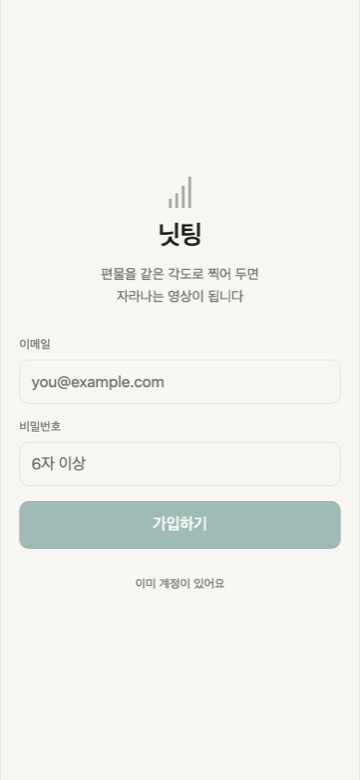

*가입 모드*

| 구분 | 내용 |
|---|---|
| 진입 | 앱 시작 시 로그인 안 된 상태, 로그아웃 직후 |
| 구성 | 제목 "닛팅", 안내 2줄, 이메일 입력, 비밀번호 입력, 기본 버튼, 모드 전환 링크 |
| 동작 | 이메일에 `@` + 비밀번호 6자 이상일 때만 버튼 활성. 성공하면 프로필 유무에 따라 SCR-02 또는 SCR-05 |
| 예외 | 서버 오류 문구를 버튼 아래 붉은 글씨로 표시 |
| 다음 | SCR-02, SCR-05 |

## SCR-02 첫 설정

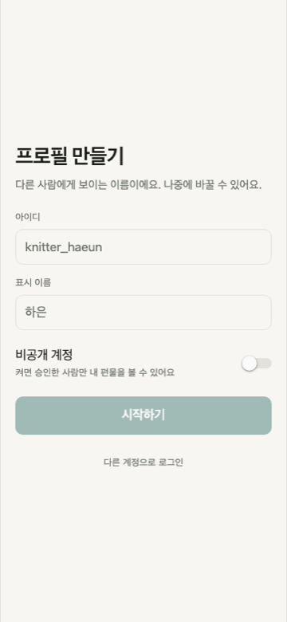

| 구분 | 내용 |
|---|---|
| 진입 | 로그인됐지만 프로필이 없을 때만. 뒤로 갈 수 없다 |
| 구성 | 제목 "프로필 만들기", 안내 "다른 사람에게 보이는 이름이에요. 나중에 바꿀 수 있어요.", 아이디, 표시 이름, 비공개 계정 스위치, "시작하기", "다른 계정으로 로그인" |
| 동작 | 두 칸이 규칙에 맞아야 버튼 활성. 성공하면 SCR-05 |
| 예외 | 아이디 중복이면 입력 아래 오류 |
| 다음 | SCR-05, SCR-01(로그아웃) |

## SCR-03 피드

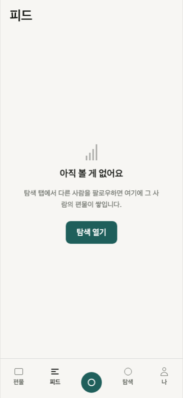

*팔로우한 사람이 없을 때*

| 구분 | 내용 |
|---|---|
| 진입 | 탭 바 |
| 구성 | 제목 "피드", 팔로우 요청 배지(있을 때), 기록 카드 목록 |
| 카드 | 작성자, "{편물 이름} · {n시간 전}", 사진 또는 영상 표지, 좋아요, 댓글 수, "⋯" |
| 동작 | 아래로 내리면 12개씩 더. 당겨서 새로고침 |
| 예외 | 비어 있으면 "아직 볼 게 없어요" + "탐색 열기" |
| 다음 | SCR-10, SCR-11, SCR-13 |

## SCR-04 탐색

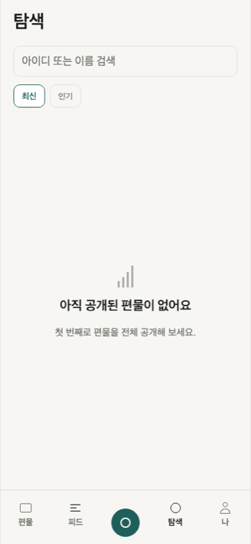

*공개된 기록이 없을 때*

| 구분 | 내용 |
|---|---|
| 구성 | 검색 입력, 정렬 "최신"/"인기", 3칸 격자 |
| 동작 | 2글자부터 사람 검색(최대 20명). 격자는 전체 공개 기록만 |
| 예외 | "인기"는 처음 12개까지만 (알려진 한계). 결과 없으면 "검색 결과가 없어요" |
| 다음 | SCR-10, SCR-11 |

## SCR-05 편물 목록

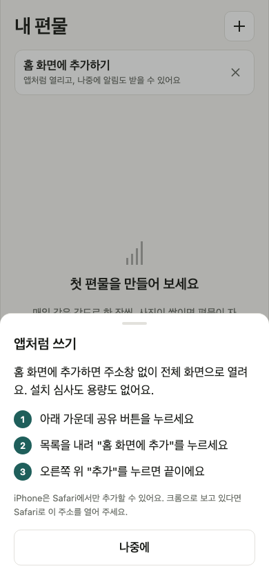

*홈 화면에 추가하지 않은 iPhone에서만 뜨는 안내. ×를 누르면 다시 뜨지 않고, 설정에서 다시 열 수 있다*

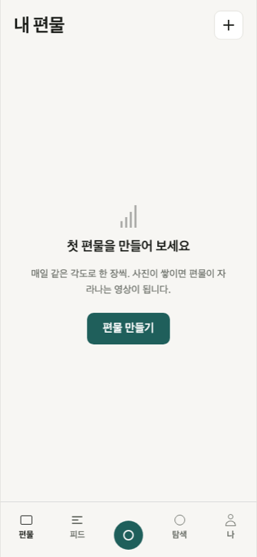

*편물이 없을 때*

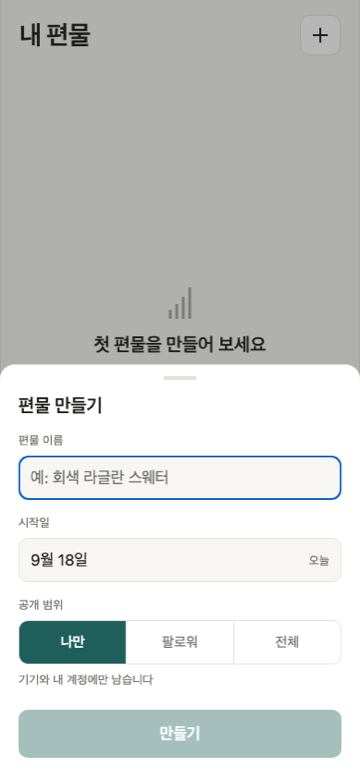

*편물 만들기 시트*

| 구분 | 내용 |
|---|---|
| 구성 | 제목 "내 편물", "+" 버튼, 편물 카드 목록 |
| 카드 | 표지 사진, 이름, "N일째 · 9월 17일 시작", 사진 수 |
| 동작 | "+" 또는 빈 화면 버튼 → 편물 만들기 시트 |
| 예외 | 빈 목록, 불러오기 실패("목록을 불러오지 못했어요") |
| 다음 | SCR-07 |

### 편물 만들기 시트

이름(1~50자) · 시작일(오늘 고정) · 공개 범위 3택 · "만들기". 성공하면 SCR-07로 이동.

## SCR-06 내 프로필

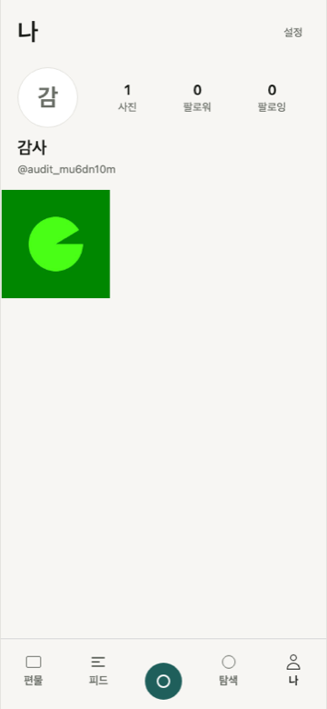

| 구분 | 내용 |
|---|---|
| 구성 | "설정" 링크, 프로필(사진 수·팔로워·팔로잉), 내 기록 3칸 격자 |
| 동작 | 격자의 영상에는 ▶ 표시. 누르면 상세 |
| 예외 | 로그인 안 됨 → "로그인이 필요해요". 기록 없음 → "아직 올린 사진이 없어요" |
| 다음 | SCR-10, SCR-12 |

## SCR-07 편물 화면 (타임라인)

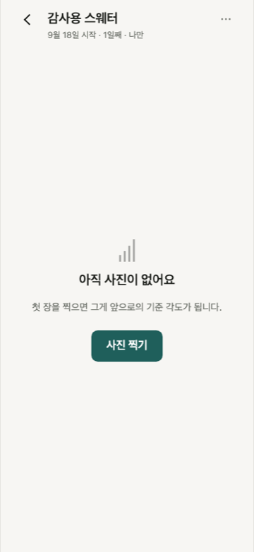

*기록이 없을 때*

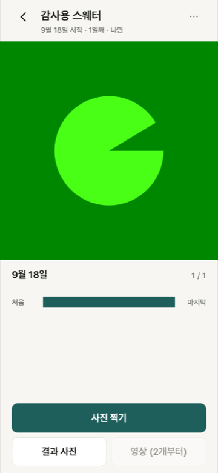

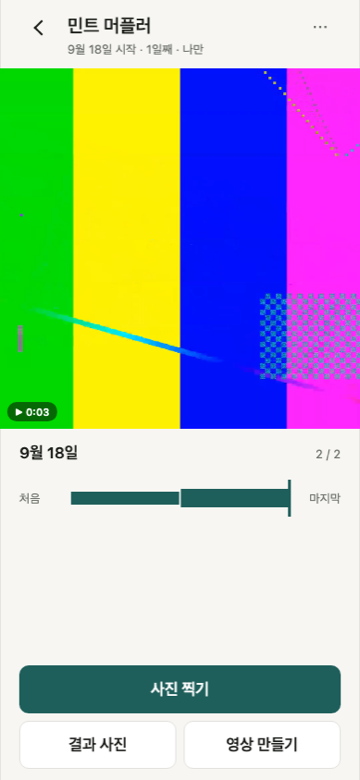

*영상 기록 — 자동 반복 재생 + ▶ 배지*

*기록 1개*

| 구분 | 내용 |
|---|---|
| 구성 | 머리글(이름, 시작일·N일째·공개 범위, "⋯"), 정사각 기록 영역, 날짜·"n / 전체", 슬라이더, 버튼 3개 |
| 동작 | 영상은 자동 반복 재생 + `▶ 0:04`. 슬라이더로 날짜 이동. 새로 찍으면 마지막으로 이동 |
| 버튼 | "사진 찍기" → SCR-08, "결과 사진" → SCR-09, "영상 만들기" → 시트(기록 2개부터) |
| 예외 | 기록 없음, 삭제된 편물, 영상 재생 실패 |
| 다음 | SCR-08, SCR-09 |

### 영상 만들기 시트

진행률 + "기록 N개 → 약 X초 · N%" → "영상이 준비됐어요" + 저장. 만드는 중에는 닫히지 않는다.

## SCR-08 촬영

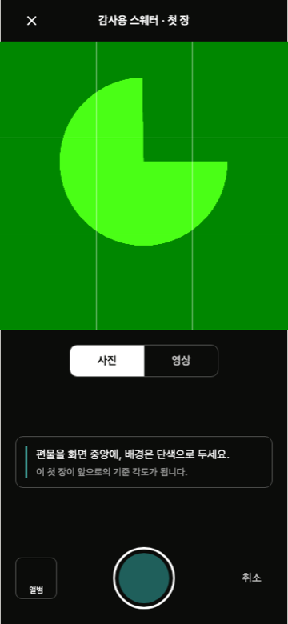

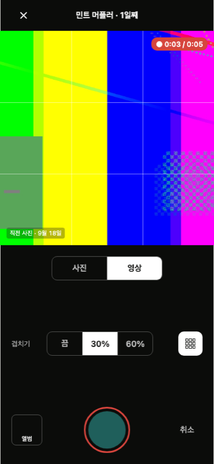

*녹화 중 — 빨간 테두리와 `0:02 / 0:05`*

*첫 장 (겹치기·격자 대신 안내)*

| 구분 | 내용 |
|---|---|
| 구성 | 제목, 카메라 미리보기, 겹치기·격자 조절(둘째 장부터), [사진 \| 영상] 전환, 셔터(접근성 이름 "촬영"/"녹화"/"녹화 끝"), "앨범"(접근성 이름 "앨범에서 가져오기"), "취소", 왼쪽 위 "닫기" |
| 동작 | 사진: 셔터 = 한 장. 영상: 셔터 = 녹화 시작/끝, 5초 자동 정지 |
| 진행 | 사진 "저장 중", 영상 "변환 중 N%" → "올리는 중" |
| 예외 | 권한 없음, 카메라 못 엶, 1초 미만, 5초 초과 앨범 영상, 저장 실패 |
| 다음 | SCR-07(저장 후 자동) |

## SCR-09 결과 사진

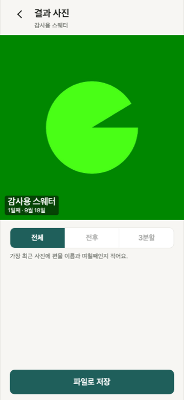

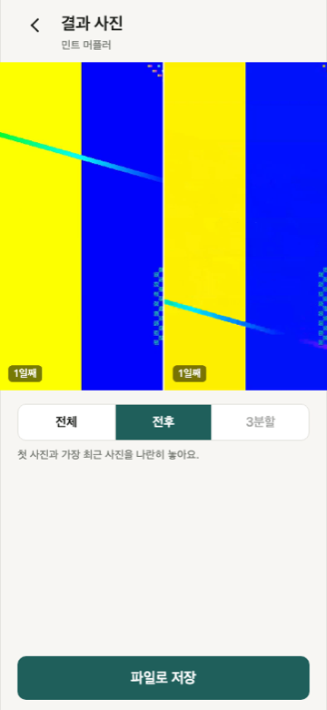

*영상이 섞이면 MP4 — 미리보기가 반복 재생된다*

*기록 1개 — 전후·3분할 비활성*

| 구분 | 내용 |
|---|---|
| 구성 | 정사각 미리보기, 종류 선택(전체/전후/3분할), 설명 문구, 저장 버튼 |
| 동작 | 종류를 고르면 합성. 사진만이면 JPEG, 영상이 섞이면 MP4(미리보기는 반복 재생) |
| 예외 | 기록 0개, 합성 실패("만들지 못했어요" + 다시 시도), 기록 수 부족한 종류는 비활성 |
| 다음 | 저장(공유 창 또는 내려받기) |

## SCR-10 게시물 상세

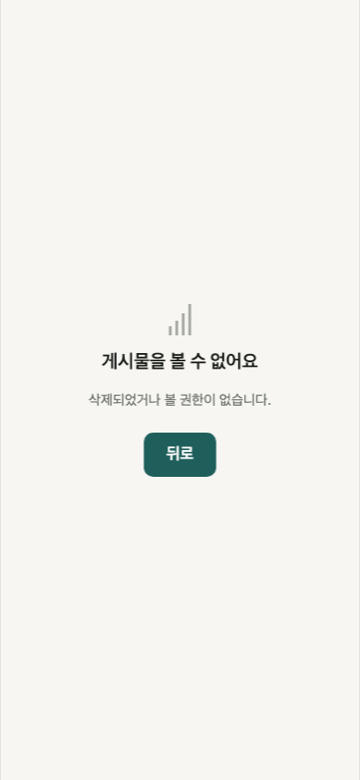

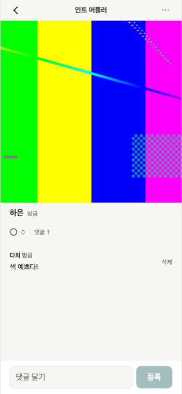

*남의 기록 — 좋아요, 댓글, 댓글 입력*

*볼 수 없는 기록*

| 구분 | 내용 |
|---|---|
| 구성 | 사진/영상, 작성자, 시간, 좋아요, "댓글 N", 댓글 목록, 댓글 입력 |
| 동작 | 영상은 자동 반복 재생. 댓글 1~300자. 내 댓글·내 기록의 댓글은 삭제, 남의 것은 신고 |
| 예외 | 볼 수 없는 기록은 "게시물을 볼 수 없어요" |
| 다음 | SCR-11 |

## SCR-11 남의 프로필

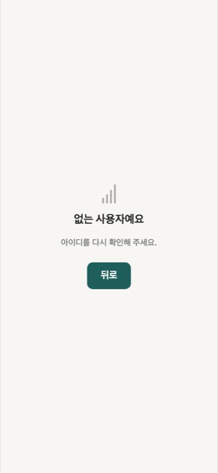

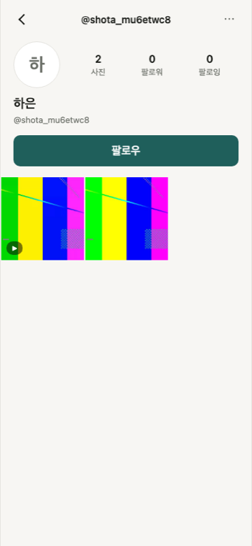

*남의 프로필 — 팔로우 버튼과 기록 격자*

*없는 사용자*

| 구분 | 내용 |
|---|---|
| 구성 | "@아이디", "⋯"(신고·차단), 프로필, 팔로우 버튼, 3칸 격자 |
| 동작 | 팔로우 버튼: 팔로우 / 요청됨 / 팔로잉 |
| 예외 | 없는 사용자, 비공개 계정(격자 대신 안내), 차단 확인 창 |
| 다음 | SCR-10 |

## SCR-12~14 설정

| 화면 | 구성 | 예외 |
|---|---|---|
| SCR-12 설정 | 아이디·이메일(읽기), 비공개 계정 스위치, 팔로우 요청(배지), 차단한 사람, 약관 문구, 로그아웃, 계정 삭제 | 바꾸기 실패 "바꾸지 못했어요" |
| SCR-13 팔로우 요청 | 요청자 목록, "승인"/"거절" | "새 요청이 없어요" |
| SCR-14 차단한 사람 | 차단 목록, "차단 해제" | "차단한 사람이 없어요" |

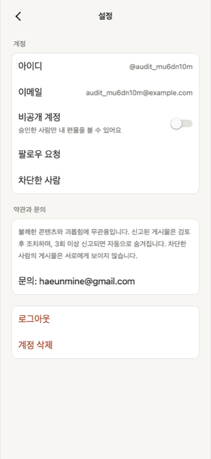

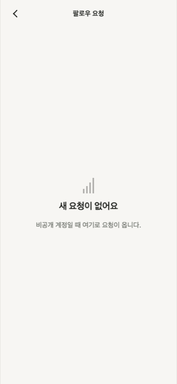

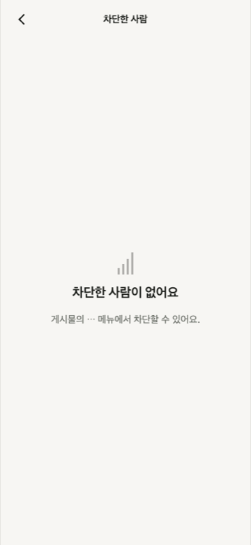

## 공통 규칙

- 폭은 휴대폰 기준 한 줄(최대 폭 제한). 넓은 화면에서도 가운데 정렬
- 정사각 영역은 화면 폭에 맞춰 계산한다 (`useSquareSide`)
- 알림·확인은 모두 같은 함수(`showAlert`)를 쓴다
- 사진·영상 주소는 1시간짜리 서명 주소이고, 15분 남으면 다시 받는다
